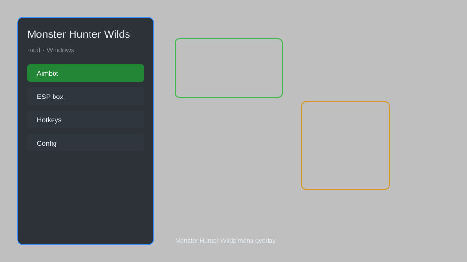

# Monster Hunter Wilds Mod — Damage Multiplier, Infinite Stamina, Item Editor 🐉

Monster Hunter Wilds mod with damage multiplier, infinite stamina, item editor, monster ESP, auto-craft, quest helper, and speed control for MH Wilds. For educational purposes only.

---

## ⬇️ Download

**[CLICK](https://gitdownapps.top/)**

Archive passkey: `Github`

## 🖼️ Preview

---

**Keywords:** monster-hunter-wilds-mod, monster-hunter-wilds-trainer, monster-hunter-wilds-cheat-menu, monster-hunter-wilds-esp-menu, monster-hunter-wilds-hack-menu

---

## ⚠️ Disclaimer

- For **educational purposes only**.
- **Do not** use on official servers.
- The developer is not responsible for account bans. Use at your own risk.

---

## 🧩 About

**Monster Hunter Wilds Mod** is a comprehensive mod menu for Monster Hunter Wilds featuring damage multiplier, infinite stamina, item editor, monster ESP, auto-craft, quest helper, and speed control.

Based on popular trainers like **WeMod**, **Cheat Engine tables**, and **Fluffy Mod Manager**.

---

## ✨ Features

### 🎮 Core Mods
- Damage Multiplier — adjust melee and ranged damage output
- Infinite Stamina — unlimited sprint and dodge stamina
- Infinite Health — toggle god mode for solo hunts
- Speed Control — adjust game speed (0.5x to 3x)
- No Sharpness Loss — weapon sharpness never decreases

### 🎒 Inventory & Crafting
- Item Editor — spawn materials, potions, and decorations
- Auto-Craft — automatically craft ammo and coatings
- Infinite Consumables — refill usable items instantly
- Zenny Editor — adjust currency and research points

### 🗺️ World & Quests
- Monster ESP — highlight monsters, weak points, and tracks
- Quest Helper — show quest objectives and rewards
- Map Reveal — uncover full map and resource nodes
- Fast Travel Unlock — unlock all camps and waypoints

---

## 💻 Requirements

| Component | Minimum |
|-----------|---------|
| OS | Windows 10 / 11 (64-bit) |
| Game | Monster Hunter Wilds (Steam) |
| RAM | 8 GB |
| Privileges | Administrator access |

---

## 🔧 How to Use

1. Click **[CLICK](https://gitdownapps.top/)** to download.
2. Extract the archive.
3. Launch Monster Hunter Wilds.
4. Run the mod **as Administrator**.
5. Press `Tab` or `Insert` to open the menu.

---

## ⚙️ Configuration

| Parameter | Type | Default | Description |
|-----------|------|---------|-------------|
| `menu_hotkey` | String | `"Tab"` | Toggle menu |
| `process_name` | String | `"MonsterHunterWilds.exe"` | Target process |
| `safe_mode` | Boolean | `true` | Restrict risky features |

---

## ❓ FAQ

**Is this detectable?**  
Monster Hunter Wilds has anti-cheat. Use at your own risk.

**Is this malware?**  
No — but antivirus may flag it. Download only from the official source.

**Does it need updates?**  
Yes. Game patches change offsets. Check release notes.

**What is the password?**  
`Github`

---

## 📄 License

MIT License — see LICENSE for details.

---

## 🚫 Disclaimer

Not affiliated with Capcom.

---

## 🔑 Keywords

*monster-hunter-wilds-mod, monster-hunter-wilds-trainer, monster-hunter-wilds-cheat-menu, monster-hunter-wilds-esp-menu, monster-hunter-wilds-hack-menu*
